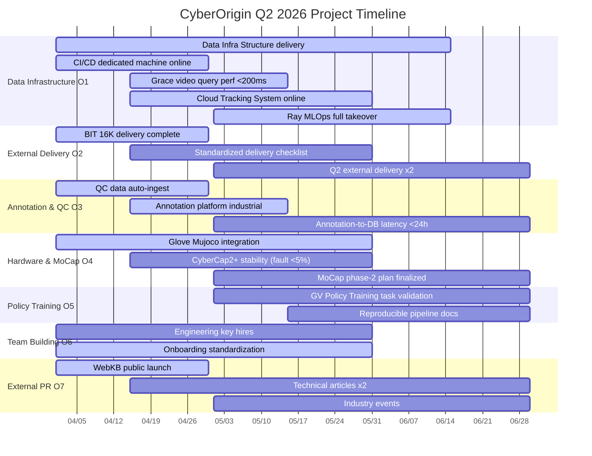

## Overview

**Cycle**: 2026-04-01 → 2026-06-30  |  **Core theme**: wire up the capture→annotation→delivery pipeline, commercialization kickoff

Three-phase rhythm: **April sprint execution** → **May system integration** → **June wrap-up delivery**

---

## Gantt

---

## Key Milestones

| Date | Milestone | Owner | Priority |
|---|---|---|---|
| 2026-04-30 | BIT 16K data delivery complete | Shiqi | P0 |
| 2026-04-30 | CI/CD dedicated machine online | chengpei | P0 |
| 2026-04-30 | QC data auto-ingest | Shiqi | P1 |
| 2026-04-30 | WebKB public launch | Max | P1 |
| 2026-05-15 | Grace query response < 200ms | Shiqi | P1 |
| 2026-05-15 | Annotation platform industrial | Shiqi | P1 |
| 2026-05-31 | Cloud Tracking System online | Shiqi | P0 |
| 2026-05-31 | Glove Mujoco integration complete | lizi | P1 |
| 2026-05-31 | Engineering key hires | Max | P1 |
| **2026-06-15** | **Data Infra Structure delivery (hard deadline)** | **Max** | **P0** |
| 2026-06-15 | Ray MLOps full takeover | Max | P0 |
| 2026-06-30 | Policy Training initial validation | Shiqi | P2 |
| 2026-06-30 | MoCap phase-2 plan finalized | Yu Liang | P2 |
| 2026-06-30 | Q2 retro & Q3 planning kickoff | Max | — |

---

## Phase Highlights

### April (sprint execution)

Launch the tasks that ship results fastest and kill all manual workflows. BIT 16K and WebKB are the month's two externally visible delivery points.

### May (system integration)

All systems run end-to-end: capture → ingest → query fully automated. Cloud Tracking System is May's main thread.

### June (wrap-up delivery)

Data Infra Structure must ship by 6/15 — the only hard deadline this quarter. Late June shifts into Q3 planning.

---

## Full OKR Document

Detailed Key Results and status: [Product Roadmap](/en/company/roadmap).

## Related Reading

<CardGroup cols={2}>
  <Card title="Product Roadmap" icon="map" href="/en/company/roadmap">
    Current-stage goals and quarterly milestones
  </Card>
  <Card title="Company Overview" icon="building" href="/en/company/overview">
    Who we are, what we do, core technology bets
  </Card>
</CardGroup>
