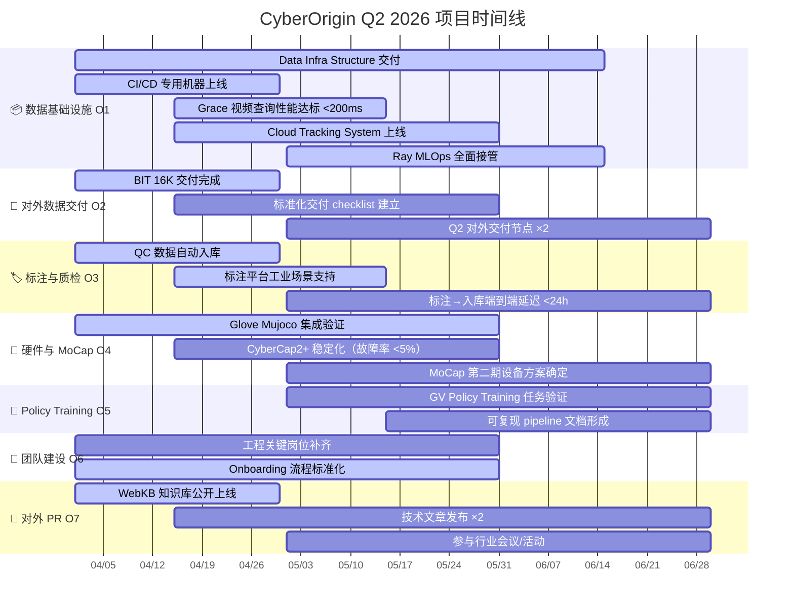

## 总览

**周期**：2026-04-01 → 2026-06-30　｜　**核心主题**：打通采集→标注→交付完整链路，商业化起跑

三个阶段节奏：**4月冲刺执行** → **5月系统联通** → **6月收尾交付**

---

## 甘特图

---

## 关键里程碑

| 日期 | 里程碑 | 负责人 | 优先级 |
|---|---|---|---|
| 2026-04-30 | BIT 16K 数据交付完成 | Shiqi | P0 |
| 2026-04-30 | CI/CD 专用机器上线 | chengpei | P0 |
| 2026-04-30 | QC 数据自动入库 | Shiqi | P1 |
| 2026-04-30 | WebKB 知识库对外上线 | Max | P1 |
| 2026-05-15 | Grace 查询响应 < 200ms | Shiqi | P1 |
| 2026-05-15 | 标注平台支持工业任务 | Shiqi | P1 |
| 2026-05-31 | Cloud Tracking System 上线 | Shiqi | P0 |
| 2026-05-31 | Glove Mujoco 集成完成 | lizi | P1 |
| 2026-05-31 | 工程关键岗位补齐 | Max | P1 |
| **2026-06-15** | **Data Infra Structure 交付（硬性截止）** | **Max** | **P0** |
| 2026-06-15 | Ray MLOps 全面接管 | Max | P0 |
| 2026-06-30 | Policy Training 初步验证 | Shiqi | P2 |
| 2026-06-30 | MoCap 第二期方案确定 | Yu Liang | P2 |
| 2026-06-30 | Q2 复盘 & Q3 规划启动 | Max | — |

---

## 各阶段重点

### 4月（冲刺执行）

启动最快能出结果的任务，消灭所有手动流程。BIT 16K 和 WebKB 是本月两个对外可见的交付节点。

### 5月（系统联通）

所有系统跑通端到端链路：采集→入库→查询全自动化。Cloud Tracking System 是 5 月的主线。

### 6月（收尾交付）

Data Infra Structure 必须在 6/15 前交付，这是本季唯一硬性截止节点。后半月进入 Q3 规划。

---

## 完整 OKR 文档

详细 Key Results 和状态见 [产品路线图](/zh/company/roadmap)。

## 延伸阅读

<CardGroup cols={2}>
  <Card title="产品路线图" icon="map" href="/zh/company/roadmap">
    当前阶段目标与本季度里程碑
  </Card>
  <Card title="公司概览" icon="building" href="/zh/company/overview">
    我们是谁、做什么、核心技术判断
  </Card>
</CardGroup>
